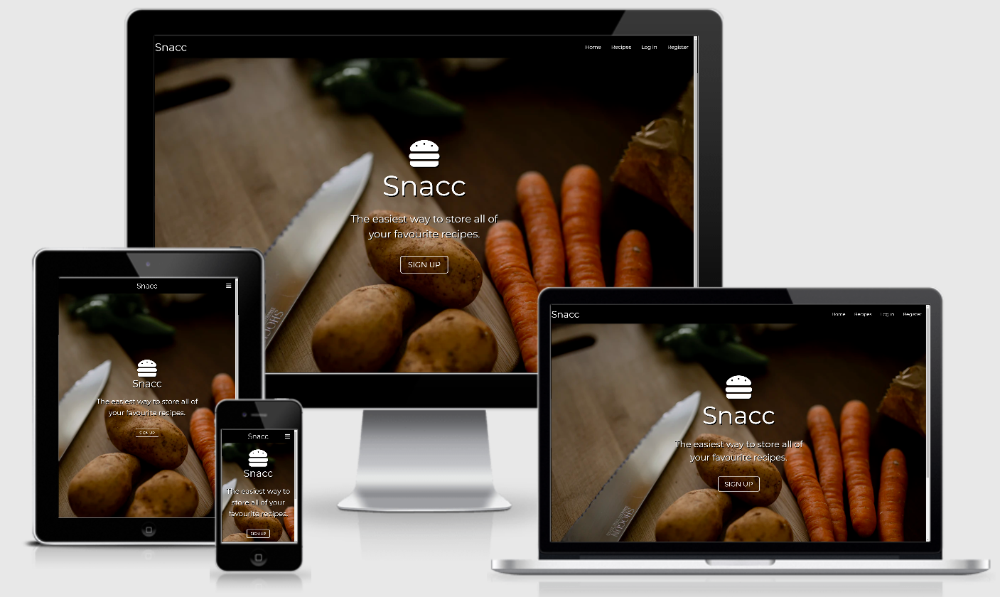
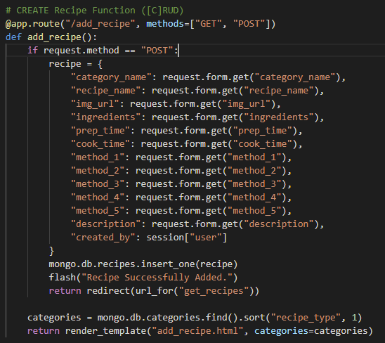
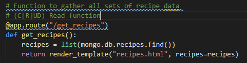
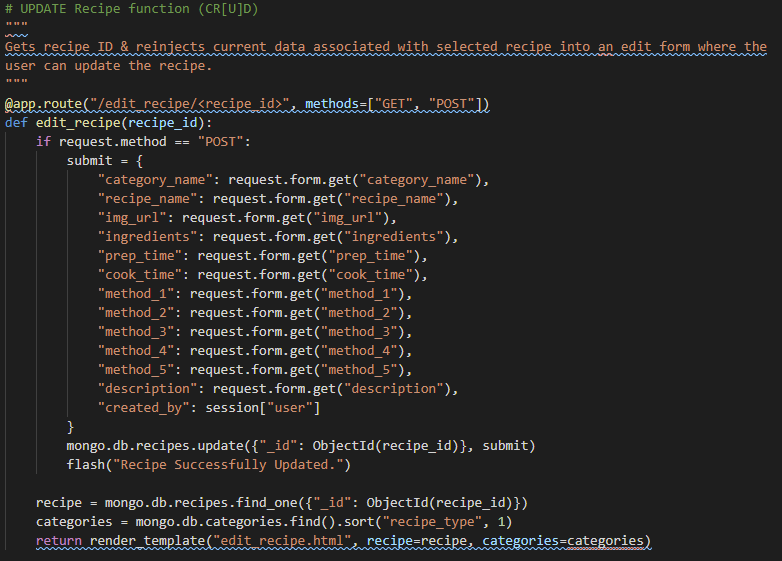
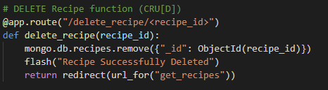
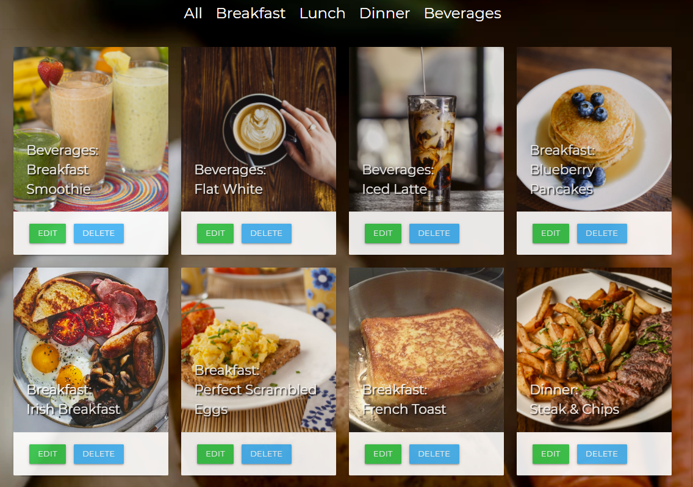
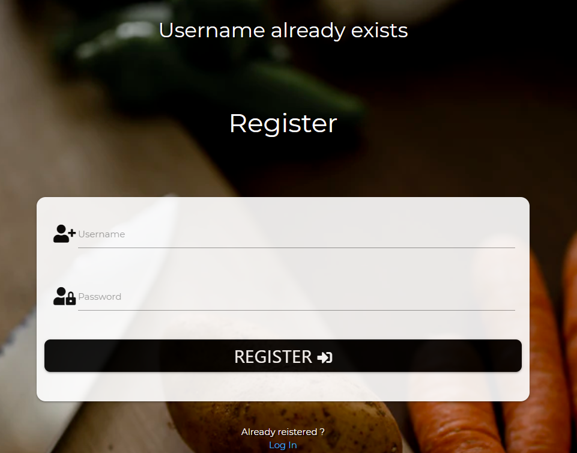
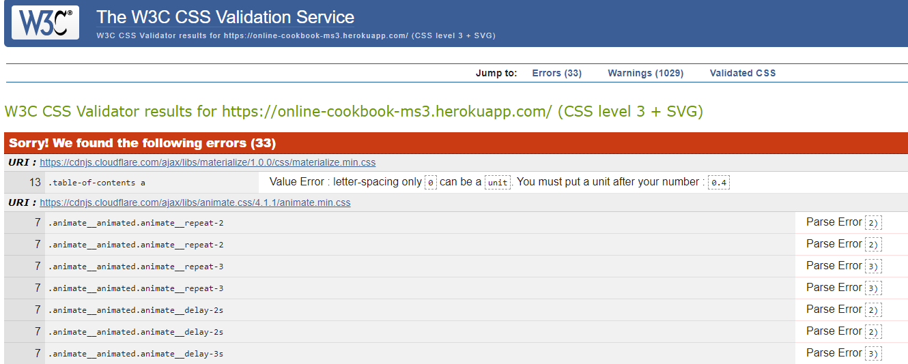

# <a href="https://online-cookbook-ms3.herokuapp.com/">Snacc</a>

This [project](https://online-cookbook-ms3.herokuapp.com/) is my third milestone project (Data Centric Development) in Full Stack Software Development course run by [Code Institute](https://codeinstitute.net/)

Want to store your favourite recipes all in one place?
This website allows you to share your favourite recipes! You can also see recipes that other user's have submitted.
Create, read, update & delete recipes once you register on site.
You can also browse recipes on the database by category - Breakfast, Lunch, Dinner & Beverages!

## Table of Contents
1. [**UX**](#ux)
    - [**User Stories**](#user-stories)
    - [**Design**](#design)
        - [**Framework**](#framework)
        - [**Color Scheme**](#color-scheme)
        - [**Icons**](#icons)
        - [**Typography**](#typography)

2. [**Features**](#features)
    - [**Existing Features**](#existing-features)
    - [**Features Left to Implement**](#features-left-to-implement)

3. [**Technologies Used**](#technologies-used)
    - [**Front-End Technologies**](#front-end-technologies)
    - [**Back-End Technologies**](#back-end-technologies)
    - [**Tools**](#tools)
    - [**Resources**](#resources)

4. [**Testing**](#testing)
    - [**Validators**](#validators)
    - [**Compatibility**](#compatibility)
    - [**Known Issues**](#known-issues)

5. [**Deployment**](#deployment)
    - [**Local Deployment**](#local-deployment)
    - [**Remote Deployment**](#remote-deployment)

6. [**Credits**](#credits)
    - [**Content**](#content)
    - [**Media**](#media)
    - [**Code**](#code)
    - [**Acknowledgements**](#acknowledgements)

7. [**Resubmit Fixes**](#resubmission)
    - [**Errors Addressed**](#errors)

## UX
 
This website is made for people who love to cook & want an easy solution to storing their favourite recipes all in one place.
Registered users can submit their favourite recipes, update recipes & delete recipes they created that they no longer use!
The website is a dark themed website which utilizes the Materialize library to create responsive web design & cards for displaying recipes.

### User Stories

"**_As a user, I would like to_** _____________________________"

:white_check_mark: *denotes items that have been successfully implemented*

- :white_check_mark: *view the site* from **any device** *(mobile, tablet, desktop)*.
- :white_check_mark: *view all recipes* as a **Guest**.
- :white_check_mark: *manage recipes* as a **User**
- :white_check_mark: *sort/order recipes* by **recipe name, breakfast type, lunch type, dinner type, beverage type**.
- :white_check_mark: *search recipes* by **recipe name, recipe type**.
- :white_check_mark: **limit** the number of *recipes* to display by category type, or see *all recipes*.
- :white_check_mark: *create* my **own profile**.
- :white_check_mark: *create* my **own recipes**.
- :white_check_mark: *add* my **own recipes**.
- :white_check_mark: *edit* my **own recipes**.
- :white_check_mark: *delete* my **own recipes**.
- :white_check_mark: be able to **log out**.

### Design

- The design of this website focuses on a dark themed background and displays the recipes on site in responsive MaterializeCSS cards.
- The visual contrast to the dark theme background is highlighted by the vivid & bright colours in the current recipe images, making it visually striking to users visiting the site.
- I wanted the website to have a simplistic high contrast colour scheme.
- I wanted the website to be intuitive and easy to navigate.
- I wanted to achieve a clean, uncluttered aesthetic.
- I wanted the website to be accessible & responsive on all modern devices (desktop, mobile, tablet).

#### Frameworks

- [MaterializeCSS](https://materializecss.com/)
    - My preferred CSS framework for this project because of its visually striking elements, simple-to-understand documentation & simplicity of use.
- [jQuery 3.6.0](https://code.jquery.com/jquery/)
    - In an effort to keep the JavaScript minimal, I have decided to use jQuery as foundation to my scripts framework.
- [Flask](https://flask.palletsprojects.com/en/1.1.x/)
    - Flask is a free micro web framework that I've used to render the back-end Python with the front-end MaterializeCSS Framework and AnimateCSS Library. 

#### Color Scheme

-  When creating this website I favoured simplicity, dark thematic backround and relied on the vivid & colourful recipe images for aesthetic visual contrast, which presents itself as striking to the user.
-  The color scheme used for this website is simply Black/White with images taken from [Unsplash](https://unsplash.com/) & [BBC Good Food](https://www.bbcgoodfood.com/)

-  `#fff`
-  `#000`

#### Icons

- [Font Awesome 5.15.3](https://fontawesome.com/)
    - Font Awesome was my preferred source for icon use across the site rather than Materialize Icons. Font Awesome Icons are simplistic & easily customizable and displayed through *classes* rather than *text*
    which fits the aesthetic Snacc is targetting

#### Typography

- [Google Fonts](https://fonts.google.com/) were used across the site:
- [Montserrat](https://fonts.google.com/specimen/Montserrat#standard-styles) : default font.
- [AnimateCSS](https://animate.style/) : Animations used for landing page heading.
- [MaterializeCSS](https://materializecss.com/) : Typography / Colors Documentation from MaterializeCSS was used across the site.

##### back to [top](#table-of-contents)

## Features
 
### Existing Features

**Register Account** 
- Anybody can register for free and create their own unique account. There is built-in authentication and authorization to check certain criteria is met before an account is validated. All passwords are hashed for security purposes!

**Log In to Account**
- If you are an existing user I have built an authorization feature that checks if the hashed passowrd & username match whats in the database.

**Log Out of Account**
- Existing users can choose to log out if they are finished using the website. 

**View all recipes**
- Both registered users & guests can view the existing recipes available on the site. 

**Search all recipes**
- Both registered users & guests can search existing recipes available on site via text input.

**Filter recipes**
- Both registered users & guests can filter existing recipes available on site by recipe type, e.g breakfast, lunch, dinner.

**Manage recipes**
- Registered users can access the manage recipes page which allows for updating current recipes in database or deleting recipes (provided the user has created the recipe they wish to delete). 

**Add recipes**
- [**C**RUD] Registered users can create / add new recipes to the website. Certain defensive programming functions have been implemented such as having the required attribute on multiple input fields whilst adding a recipe. No submission goes through unless input requirements are met.

**View recipes**
-[C**R**UD] Both guest & registered users can view recipes on site. By clicking the expandable 'Click for more' element under a recipe, 
the user can view all associated data with that recipe ranging from recipe name, prep / cook time, ingredients to how to steps

**Edit/Update recipes**
-[CR**U**D] Registered users can update recipes on the current database. Flash message lets user know if a recipe has been successfully updated.

**Delete recipes**
-[CRU**D**] Only registered users can utilize the delete feature on the website. Defensive programming function has been implemented so that users can only delete recipes on the website that they have created using their profile. A flash message also appears on clicking the delete button to confirm whether or not the user wants to delete the recipe. 

**Admin**
-There is an admin profile which allows full access to CRUD functions on the website.
    -Admin can edit/delete any recipe from the database

Admin may delete/update any recipe on the database
Registered users will only see the delete button for recipes they have submitted.

### Features Left to Implement

**More features regarding users control over their profiles.**
    -Enable to delete their account on site.
    -Enable user to change passwords if they wish.
    -Enable users to filter recipes to those only they have submitted.

**Allergens, Nutritional information**
    -Further information added to each recipe

**Extra sort methods**
    -Add more filter criteria so users can filter by cuisine/nutrition/allergens.

**Extra pagination for all recipes page**
    -In the event the recipe has a high volume of recipes being submitted to the database.

None of the above features are currently implemented in project. They are speculative ideas for possible further personal development of the project.

##### back to [top](#table-of-contents)

## Technologies Used

- [Git](https://git-scm.com/) 
    - Primary version control for pushing/pulling code to & from my online repository.

- [JQuery](https://jquery.com)
    - The project uses **JQuery** to simplify DOM manipulation.

- [GitHub](https://github.com/) 
    - Used as remote storage of my code online.

- [GitPod](https://gitpod.io/) 
    - Used as my primary IDE for coding

## Frontend Technologies

- [HTML](https://en.wikipedia.org/wiki/HTML) 
    - Used as the base for markup text.

- [CSS](https://en.wikipedia.org/wiki/CSS) 
    - Used as the base for cascading styles.

- [JQuery](https://en.wikipedia.org/wiki/JQuery) 
    - Used as the primary JavaScript functionality.

- [MaterializeCSS](https://materializecss.com/)
    - Used as primary overall design framework.

- [FontAwesome](https://fontawesome.com/)
    - Used to enhance frontend styling using prebuilt icons.

- [AnimateCSS](https://animate.style/)
    - Used for animated CSS customization.

## Backend Technologies

-**Flask**

- [Flask](https://en.wikipedia.org/wiki/Flask_(web_framework)) 
    - Used as web framework.

- [Jinja 2.10](http://jinja.pocoo.org/docs/2.10/) 
    - Used for templating with Flask.

- [Werkzeug 0.16](https://werkzeug.palletsprojects.com/en/0.16.x/) 
    - Used for password hashing, authentication, and authorization.

-**Heroku**

- [Heroku](https://www.heroku.com) 
    - Used for app hosting.

-**Python**

- [Python 3.6.7](https://www.python.org/) - Used as the back-end programming language.

- [MongoDB Atlas](https://www.mongodb.com/) - Used to store my database in the 'cloud'.

- [PyMongo 3.8.0](https://api.mongodb.com/python/current/) - Used as the Python API for MongoDB.

- [Python dotenv](https://github.com/theskumar/python-dotenv) - Used to get/set values in `.env` file.

### Tools 

- [Chrome DevTools](https://developers.google.com/web/tools/chrome-devtools) - Allowed me to use browser as an editor for experimental style changes.

- [Am I Responsive](http://ami.responsivedesign.is/) - Check responsiveness of website.

### Resources

- [cdnjs](https://cdnjs.com/)
- [w3schools](https://www.w3schools.com/) 
- [Stack Overflow](https://stackoverflow.com/)
- Thorin Flask Mini Project - [Code Institute](https://codeinstitute.net/) Data Centric Development Module

##### back to [top](#table-of-contents)

## Testing

**Creating an Account**

I've created several of my own personal accounts through the development process in order to confirm authentication and validation worked as expected, along with the master *admin* account.
I have tested by also registering using a username that already exists in the database to ensure further authentication & validation.
Friends using the website have let me know they did not have any issues with registering a unique account

**Add | Edit | Delete a Recipe**

I have been adding, updating & deleting recipes using the website throughout the development of this project. 
There are no issues regarding any of these features. Users are required to fill out input fields when creating/updating recipes as a defensive programming practice to encourage quality submissions.
Flash messages let the user know if a recipe has been created, updated or deleted successfully.

**Pagination**

The pagination method on this website is used primarily to filter recipes by recipe category (breakfast, lunch, dinner)
I had a few issues implementing this feature but they were all simple issues regarding the syntax of urls called in the app.py file.

**Navigation**

I have included certain criteria in my code that hides certain navigation links to guest users.
Guest users are unable to directly access the manage recipes tab which allows for ease of updating recipes on the database.
I have tested this by creating multiple accounts & visiting the website as a guess off multiple different devices to ensure hidden nav links are working as intended.

**Log in** 

I have tested the log in feature several times over the course of creating this project, including multiple times right before project submission.
There are no issues regarding logging in with existing credentials in the database, nor were there any issues reported by friends/family who have registered and used the site.
If the username or password is entered incorrectly, a flash message will show up saying 'Incorrect username or password' which is a defensive programming feature that 
discourages malicious users brute forcing a login by guessing usernames + passwords.

**Log Out** 

I have tested the log out feature several times over the course of creating this project.
I found that there are no issues regarding the logging out function nor have a received any reports of issues from friends/family who have used the site.

**Responsiveness**

I have tested responsiveness of this website for small/medium & large devices throughout development using online resource [Am I Responsive?](http://ami.responsivedesign.is/#)
The website seems to be fully responsive according to the website and across multiple devices tested ranging from small smartphones, ipads & large desktops.

## Validators

**HTML**
- [W3C HTML Validator](https://validator.w3.org) - Unfortunately this validator is redundant regarding this project. The reason being that this HTML validator doesn't understand
Jinja templating syntax. There are a lot of errors present in my IDE also regarding doctype not being declared as Jinja is using a single html document to template the majority of the website
using ".
-Aside from the errors displaying, the code in this project is perfectly validated through localhost & the live application on Heroku.

**CSS**
- [W3C CSS Validator](https://jigsaw.w3.org/css-validator/) - I have 33 parsing errors when I run the code through this validator, however every single parsing error is due to the validator not
recognizing elements imported using [AnimateCSS](https://animate.style/) & [MaterializeCSS](https://materializecss.com/). Aside from this, the CSS code is validating fine.

**JavaScript**
- [JShint](https://jshint.com/)
    -There is only one function in this file.
    -It takes no arguments.
    -This function contains 6 statements.
    -Cyclomatic complexity number for this function is 1.

        One undefined variable
        13	$
        14	$
        15	$
        16	$
        17	$
        18	$
        19	$

**Python**
- [PEP8 Online](http://pep8online.com/)
    - App.py files are completely PEP8 compliant!
    - env.py has one non pep8 compliant line, the URL for MONGODB_URI

### Compatibility

To ensure a broad range of users can successfully use the site, I tested it across the 5 major browsers in both desktop and mobile configuration throughout the development of the project.

- **Chrome** 
- **Edge** 
- **Firefox** 
- **Safari** 
- **Opera** 

#### Screen Sizes

Using Google Chrome [DevTools](https://developers.google.com/web/tools/chrome-devtools) profiles:
- **Moto G4**
- **Galaxy S5**
- **Pixel 2/ 2XL**
- **iPhone 5/SE**
- **iPhone 6/7/8** 
- **iPhone 6/7/8 Plus** 
- **iPhone X**
- **iPad / Pro**
- **Surface Duo**
- **Galaxy  Fold**

- I have also manually tested this website across various devices I own.
    - desktop (2000px)
    - Laptop (1600px)
    - Large Phone (500px)

- The website seems to be responsive on physical devices I tested with as well as the device sizes on Chrome Dev Tools.

##### back to [top](#table-of-contents)

## Deployment

### Local Deployment

Please note - in order to run this project locally on your own system, you will need the following installed:
- [Python3](https://www.python.org/downloads) to run the application.
- [PIP](https://pip.pypa.io/en/stable/installing) to install all app requirements.
- Any IDE such as [Microsoft Visual Studio Code](https://code.visualstudio.com) or [GitPod](https://code.gitpod.io).
- [GIT](https://www.atlassian.com/git/tutorials/install-git) for cloning and version control.
- [MongoDB](https://www.mongodb.com) to develop your own database either locally or remotely on MongoDB Atlas.

Next, there's a series of steps to take in order to proceed with local deployment:

- Clone this GitHub repository by either clicking the green *Clone or download* button and downloading the project as a zip-file (remember to unzip it first), or by entering the following into the Git CLI terminal:
    - `git clone https://github.com/Shadyxstep/Online-Cookbook--MS3`.
- Navigate to the correct file location after unpacking the files.
    - `cd <path to folder>`
- Create a `.env` file with your credentials. An example can be found [here](https://github.com/Shadyxstep/Online-Cookbook--MS3/blob/master/.env_sample). Be sure to include your *MONGO_URI* and *SECRET_KEY* values.
- Create a `.flaskenv` file and add the following entries:
    - `FLASK_APP=run.py`
    - `FLASK_ENV=development`
- Install all requirements from the [requirements.txt](https://github.com/Shadyxstep/Online-Cookbook--MS3/blob/master/requirements.txt) file using this command:
    - `sudo -H pip3 -r requirements.txt`
- Sign up for a free account on [MongoDB](https://www.mongodb.com) and create a new Database called **cook_book**. The *Collections* in that database should be as follows:

**recipes**

-_id: <ObjectId>
-category_name: <string>
-recipe_name: <string>
-img_url: <string>
-prep_time: <string>
-cook_time: <string>
-ingredients: <string>
-method_1: <string>
-method_1: <string>
-method_1: <string>
-method_1: <string>
-method_1: <string>
-description: <string>
-created_by: <string>

**users**

-_id: <ObjectId>
-username: <string>
-password: <string>

**categories**

-_id: <ObjectId>
-category_name: <string>

### Remote Deployment

This site is currently deployed on [Heroku](https://www.heroku.com/) using the **master** branch on GitHub. To implement this project on Heroku, the following steps were taken:

1. Create a **requirements.txt** file so Heroku can install the required dependencies to run the app.
    - `sudo pip3 freeze --local > requirements.txt`
    - My file can be found [here](https://github.com/Shadyxstep/Online-Cookbook--MS3/blob/master/requirements.txt).
2. Create a **Procfile** to tell Heroku what type of application is being deployed, and how to run it.
    - `echo web: python run.py > Procfile`
    - My file can be found [here](https://github.com/Shadyxstep/Online-Cookbook--MS3/blob/master/Procfile).
3. Sign up for a free Heroku account, create your project app, and click the **Deploy** tab, at which point you can *Connect GitHub* as the Deployment Method, and select *Enable Automatic Deployment*.
4. In the Heroku **Settings** tab, click on the *Reveal Config Vars* button to configure environmental variables as follows:
    - **IP** : `0.0.0.0`
    - **PORT** : `8080`
    - **MONGO_URI** : `<link to your Mongo DB>`
    - **SECRET_KEY** : `<your own secret key>`
    - **MY_ADDRESS** : `<your own email address>`
    - **SEND_TO** : `<recipient email address>`
    - **PASSWORD** : `<you own email password>`
5. Your app should be successfully deployed to Heroku at this point.

##### back to [top](#table-of-contents)

## Credits

### Content
- The recipe data used for this site were obtained from

[BBCGoodFood](https://www.bbcgoodfood.com/) Plenty of high quality meal recipes.

### Media
- The photos used in this site were obtained from 

-[Unsplash](https://unsplash.com/) Free high quality stock images

### Code

- [Stack Overflow](https://stackoverflow.com/)
- [Slack](https://slack.com/intl/en-ie/) - Specifically 'Data-centric-dev' in the Code Institute Channel.
- [Python Docs](https://docs.python.org/3/)
- [AnimateCSS](https://animate.style/)
- [Flask Docs](https://flask.palletsprojects.com/en/1.1.x/)

### Acknowledgements

- I received inspiration for this project from 

-[Tim Nelson](https://github.com/TravelTimN/)
    - Found his tutorials in data centric development module of the course to be very informative and easy to understand.
    - Tried to follow his formatting style for his README files in his numerous projects.

##### back to [top](#table-of-contents)

## Resubmission

- Project feedback on HTML validation errors
    - "Validate HTML by url to ensure that there are no errors in your markup (https://validator.w3.org/nu/)., errors can be seen in pages - https://validator.w3.org/nu/?doc=https%3A%2F%2Fonline-cookbook-ms3.herokuapp.com%2Fget_recipes"
    - These have been rectified by removing empty elements & adding alt tags to all img attributes on the page.
    - [Correction Commit: 890a688](https://github.com/Shadyxstep/Online-Cookbook--MS3/commit/890a6888af043778d8afaf381927091893dfeece)
    - Retested all 17* HTML files & rectified any html parsing errors.
        - The only errors still showing up in the validator are regarding the HTML validator not recognizing jinja templating.

- Debug turned on in production version.
    - [Correction Commit: 5cd713c](https://github.com/Shadyxstep/Online-Cookbook--MS3/commit/5cd713c940aaed6029b4a8ce0a42d7abce94437e).
    - Debug is now turned to False.

- Added a table of content to readme as suggested in project feedback email.

- App.py file retested to ensure pep8 compliance. No issues found.

- static/css/style.css retested through [CSS Validator](https://jigsaw.w3.org/css-validator/validator), No issues found.

## **Disclaimer** 

All images and content on this website is for educational purposes only.

##### [Back to Table of Contents](#table-of-contents)